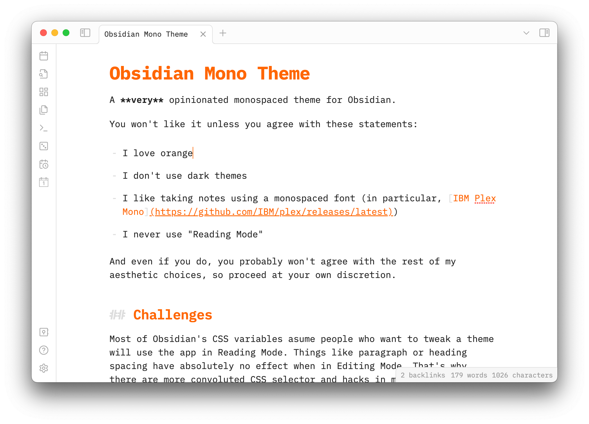

# Mono Theme

A **very** opinionated monospaced theme for Obsidian.

You won't like it unless you agree with these statements:

- I love orange
- I don't use dark themes
- I like taking notes using a monospaced font (in particular, [IBM Plex Mono](https://github.com/IBM/plex/releases/latest))
- I never use "Reading Mode"

And even if you do, you probably won't agree with the rest of my aesthetic choices, so proceed at your own discretion.

## Challenges

Most of Obsidian's CSS variables asume people who want to tweak a theme will use the app in Reading Mode. Things like paragraph or heading spacing have absolutely no effect when in Editing Mode.

That's why there are more convoluted CSS selector and hacks in my theme than I'm happy with.
